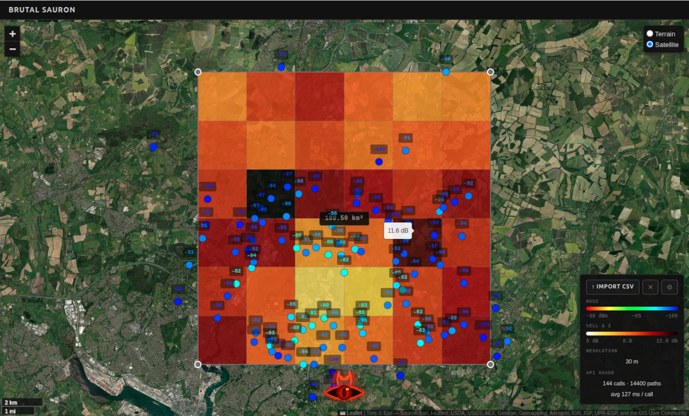

# BRUTAL-SAURON
Received power signal localisation powered by the CloudRF API.

Capable of rapid "forward simulation" of terrain and clutter (buildings, trees) with configurable transmitter, antenna, model and receiver parameters as defined in the [CloudRF API](https://cloudrf.com/documentation/developer/#tag/Create/operation/points).  

The accuracy of this grid-search technique is relative to the accuracy and environmental diversity of your survey data. Use good data from different vantage points (high, low, LOS, NLOS) with good settings and it will get you 6dB accuracy. 

If you use limited and/or poor quality survey data it won't be as accurate but varied terrain and measurements will help with scoring.



## Installation

### Prerequisites (Ubuntu LTS)

```bash
# Install Node.js LTS via NodeSource (Ubuntu's built-in version is often too old)
curl -fsSL https://deb.nodesource.com/setup_lts.x | sudo -E bash -
sudo apt-get install -y nodejs

# Install Yarn
sudo npm install -g yarn

# Install Git if not already present
sudo apt-get install -y git
```

### Setup

```bash
git clone <repo-url>
cd BRUTAL-SAURON
yarn install
```

### Run

```bash
yarn dev
```

Then open the URL printed by Vite (default: `http://localhost:5173`).

### Production build

```bash
yarn build        # outputs to dist/
npx serve dist    # or serve with nginx
```

## Operation

``Before analysis, enter your SOOTHSAYER server address and API key into the settings dialog.``

1. Import a CSV of signal measurements (see [CSV format](#csv-format) below).
2. The tool decimates the points to a maximum of 100 (minimum 300 m separation) and fits the 6×6 analysis grid over the top 30% strongest readings.
3. Reposition or resize the grid on the map if needed — drag the body to move it, drag a corner handle to resize.
4. Click the Eye of Sauron button to run the SOOTHSAYER analysis.

### Southampton demo

A demo configuration template and survey file is provided for a UHF tower in Southampton. The strongest survey results have been removed to hide the tower location which was at 50.8464, -1.3101.

## Analysis process

SOOTHSAYER uses the CloudRF POINTS API to find the most likely transmitter location by comparing measured RSSI against propagation-model predictions across the grid.

### Per-cell scoring

For each of the 36 grid cells the tool:

1. Takes the cell centre as the candidate receiver location.
2. Sends a single CloudRF POINTS request with every decimated CSV point as a transmitter, at the configured transmit parameters (`radio-template.json`).
3. Receives a predicted signal power (dBm) at the cell centre from each transmitter.
4. Computes the difference between the measured RSSI and the predicted value for every point.
5. Calculates the standard deviation (σ) of those differences.

A low σ means the propagation model agrees well with the measurements for that candidate location — i.e. the cell is a plausible transmitter site. A high σ means poor agreement.

### Request scheduling

Requests are staggered at 80 ms intervals to avoid overwhelming the API. Cells darken as their request fires and light up with their fire-palette colour as each response arrives, so progress is visible in real time.

### Colour scale

Cells are painted on a fire palette (white → amber → red → black) representing σ from best to worst agreement. The scale runs from 5 dB to the maximum observed σ, capped at 15 dB.

### Drill-down

Clicking any cell zooms the grid into that cell (with 25% padding) and re-runs the analysis at higher resolution, allowing iterative refinement of the transmitter location estimate.

### Resolution

The CloudRF output resolution scales automatically with grid area:

| Grid area | Resolution |
|-----------|------------|
| ≤ 2 km²  | 10 m       |
| 2–30 km² | area (m), rounded | 
| ≥ 30 km² | 30 m       |

## CSV format

The importer expects a headerless CSV with exactly three columns per row:

```
<Latitude>,<Longitude>,<RSSI>
```

| Column | Type | Example | Notes |
|--------|------|---------|-------|
| Latitude | decimal degrees | `50.92341` | WGS84, positive = North |
| Longitude | decimal degrees | `-1.43570` | WGS84, positive = East |
| RSSI | dBm (float) | `-72.5` | Received signal strength; higher = stronger |

Example:

```csv
50.92341,-1.43570,-72.5
50.91800,-1.44100,-85.0
50.93012,-1.42988,-61.3
```

Rows with missing or non-numeric values are silently skipped, so header rows are harmless. After import the tool decimates the dataset to a maximum of 100 points (minimum 300 m separation) and fits the analysis grid to the top 30% strongest readings.

## References

This relatively basic geo-location technique is not new but it isn't popular due to the effort required to accurately model thousands of paths. 

### Foundational & highly-cited works

**Patwari, N., Ash, J. N., Kyperountas, S., Hero, A. O., Moses, R. L., & Correal, N. S. (2005)**
*Locating the nodes: Cooperative localization in wireless sensor networks.*
IEEE Signal Processing Magazine, 22(4), 54–69.
Winner of the 2010 IEEE Signal Processing Society Best Paper Award. The canonical treatment of RSS-based ranging and cooperative localisation; covers the Cramér–Rao lower bound for position error and maximum-likelihood estimation from received power.

**Bahl, P., & Padmanabhan, V. N. (2000)**
*RADAR: An in-building RF-based user location and tracking system.*
Proceedings of IEEE INFOCOM 2000, Tel Aviv.
The most widely cited paper in RSS-based positioning. Established the empirical path-loss and fingerprinting approaches that underpin virtually all subsequent received-power localisation systems, indoor and outdoor alike.

**Gustafsson, F., & Gunnarsson, F. (2005)**
*Mobile positioning using wireless networks: Possibilities and fundamental limitations based on available wireless network measurements.*
IEEE Signal Processing Magazine, 22(4), 41–53.
Appeared in the same special issue as Patwari et al. and provides the signal-processing and statistical framework for outdoor mobile positioning from RSS, TOA, and TDOA, including derivation of achievable accuracy bounds in cellular geometries.

### Oldest known work

**Okumura, Y., Ohmori, E., Kawano, T., & Fukuda, K. (1968)**
*Field strength and its variability in VHF and UHF land-mobile radio service.*
Review of the Electrical Communications Laboratory, 16(9–10), 825–873.
The earliest large-scale empirical study of outdoor received signal strength as a function of distance, frequency, and terrain — the measurement campaign underpinning all subsequent outdoor path-loss models (Hata, COST-231, etc.) and, by extension, RSS-based transmitter localisation. Based on drive-test campaigns across the Kanto region of Japan conducted from 1962 onwards.
